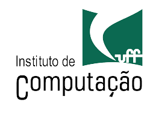

<h1>USO DE DEEP LEARNING PARA IDENTIFICAÇÃO E CLASSIFICAÇÃO DE
ARRITMIAS CARDÍACAS</h1>

Esse repositório foi criado para auxiliar no desenvolvimento da pesquisa de iniciação científica
cujo objetivo é usar técnicas de deep learning para identificar e classificar arritmias cardíacas.
 

<h3>Artigos base:</h3>
<ul>
    <li><a href="https://www.frontiersin.org/articles/10.3389/fphys.2023.1246746/full">Deep learning for ECG Arrhythmia detection and classification: an overview of progress for period 2017–2023</a>
    <li><a href="https://ieeexplore.ieee.org/stamp/stamp.jsp?tp=&arnumber=10217821">Heartbeat Dynamics: A Novel Efficient Interpretable Feature for Arrhythmias Classification</a>
    <li>
    <li>
    <li>
    <li>
</ul>

<h3>Base de dados utilizada:</h3>
<ul>
    <li><a href="https://www.kaggle.com/datasets/erarayamorenzomuten/chapmanshaoxing-12lead-ecg-database/data">A 12-lead electrocardiogram database for arrhytmia research covering more than 10,000 patients</a>
    <li><a href="https://www.kaggle.com/datasets/erarayamorenzomuten/chapmanshaoxing-12lead-ecg-database/data">Link para download dos dados</a>
</ul>

<h3>Algoritmos a serem implementados:</h3>
- [ ] Long Short Term Memory (LSTM)
 
- [ ] Support Vector Machine (SVM)
 
- [ ] Convolutional Neural Network (CNN)
 
- [ ] K-NBearest Neighbors (KNN)
 

<h3>Fases da pesquisa:</h3>
- [x] Fase 1: Leitura de artigos, pesquisas acerca do tema, escolha da base de dados a ser utilizada e planejamento;
 
- [ ] Fase 2: Escolha das técnicas de deep learning a serem utilizadas a partir de estudos anteriormente realizados;
 
- [ ] Fase 3: Implementação e validação dos algoritmos utilizados;
 
- [ ] Fase 4: Avaliação dos resultados e comparação entre os algoritmos, a fim de definir qual algoritmo é o mais eficiente, baseado em acurácia e visão computacional;
 
- [ ] Fase 5: Documentação das fases anteriores;
 
- [ ] Fase 6: Publicação de artigo e apresentações em congressos.

<h3>Equipe envolvida:</h3>

| Nome            | GitHub                  | Email                  |
| --------------- | ----------------------- | ---------------------- |
| Amanda S. Zírpolo      | https://github.com/amandazirpolo  | amandazirpolo@midiacom.uff.br |
<!--| [Outro Nome]     | [Outro Perfil no GitHub]| [Outro Email]         |-->

<h6>Orientadora: Profa. Dra. Taiane Coelho Ramos</h6>

<h2 align="center">  </h2>

<i> Universidade Federal Fluminense, 2024</i>

